# Marquee Architecture

## System Overview

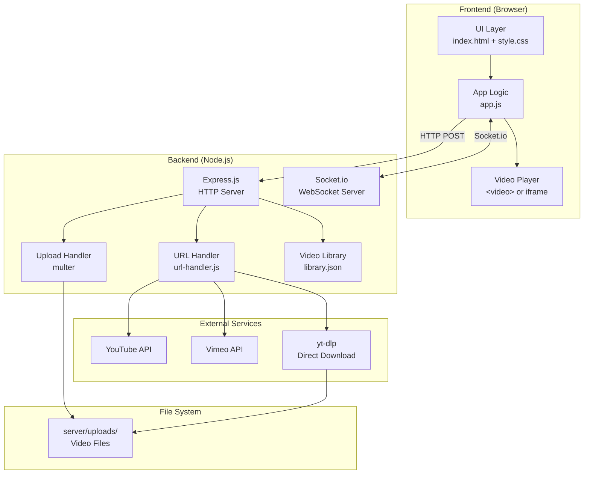

## Room Lifecycle

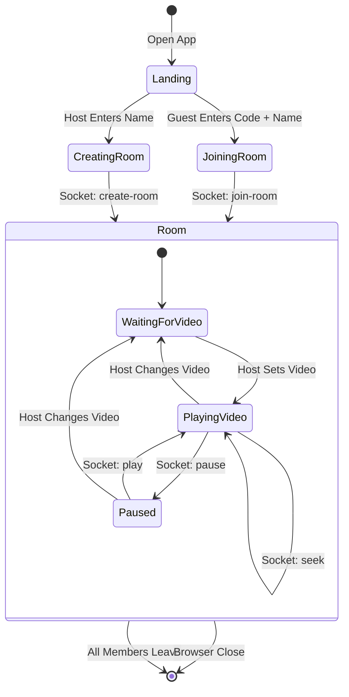

## Playback Sync Architecture

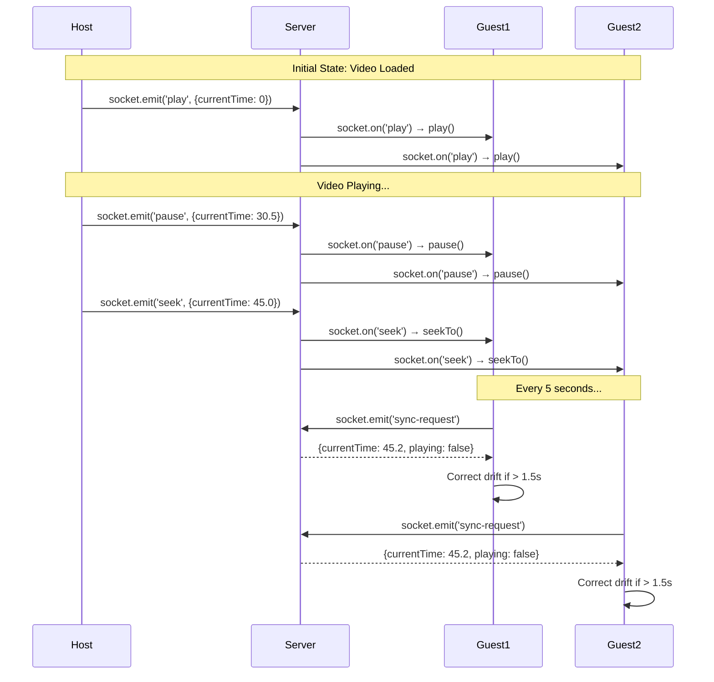

## Video Upload Flow

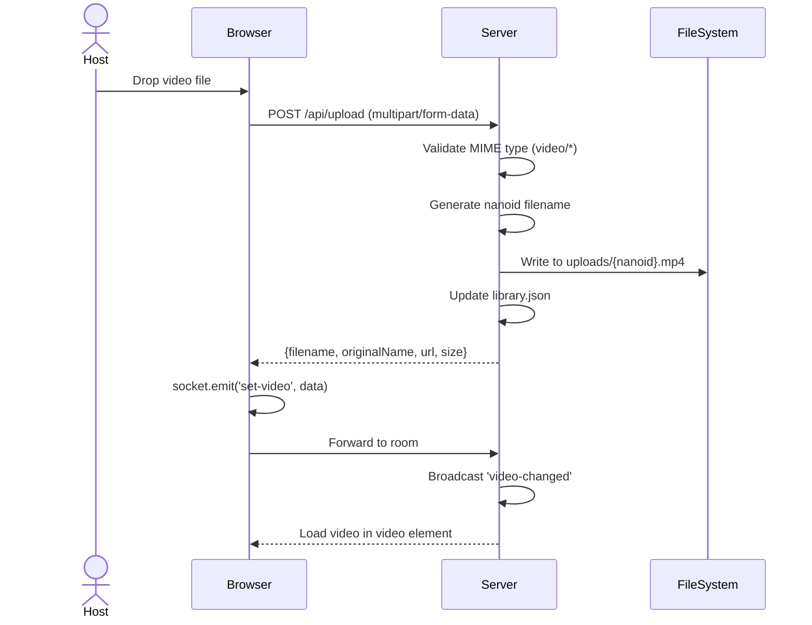

## URL Video Flow

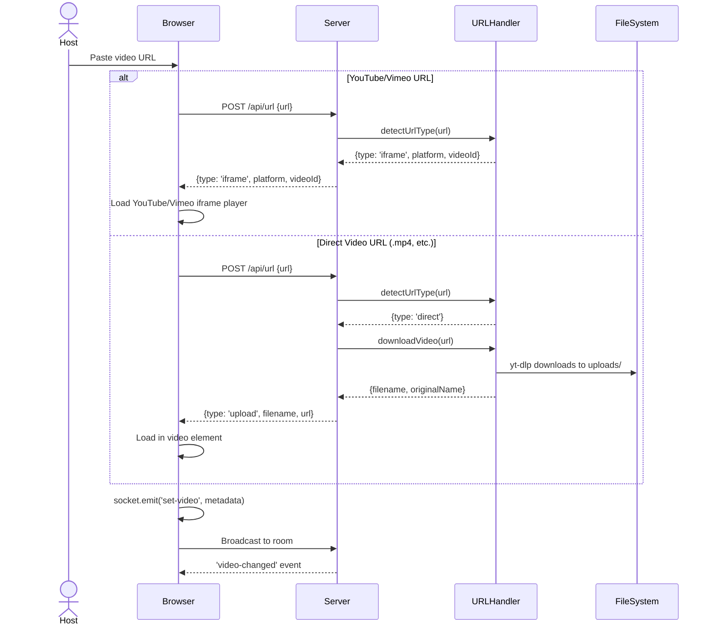

## Component Diagram

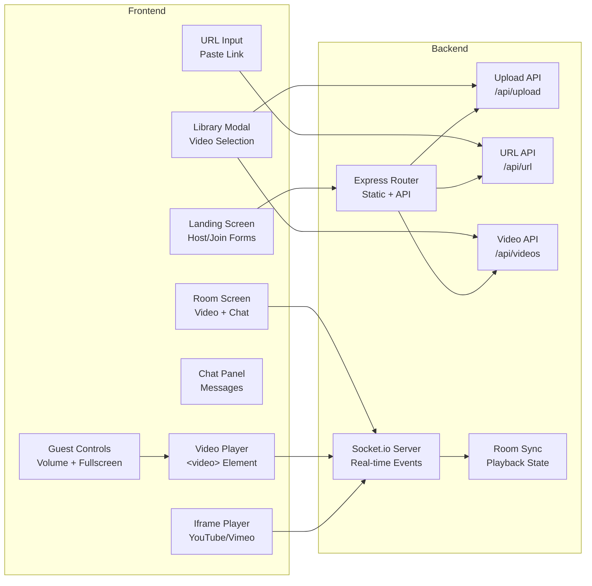

## Room State Machine

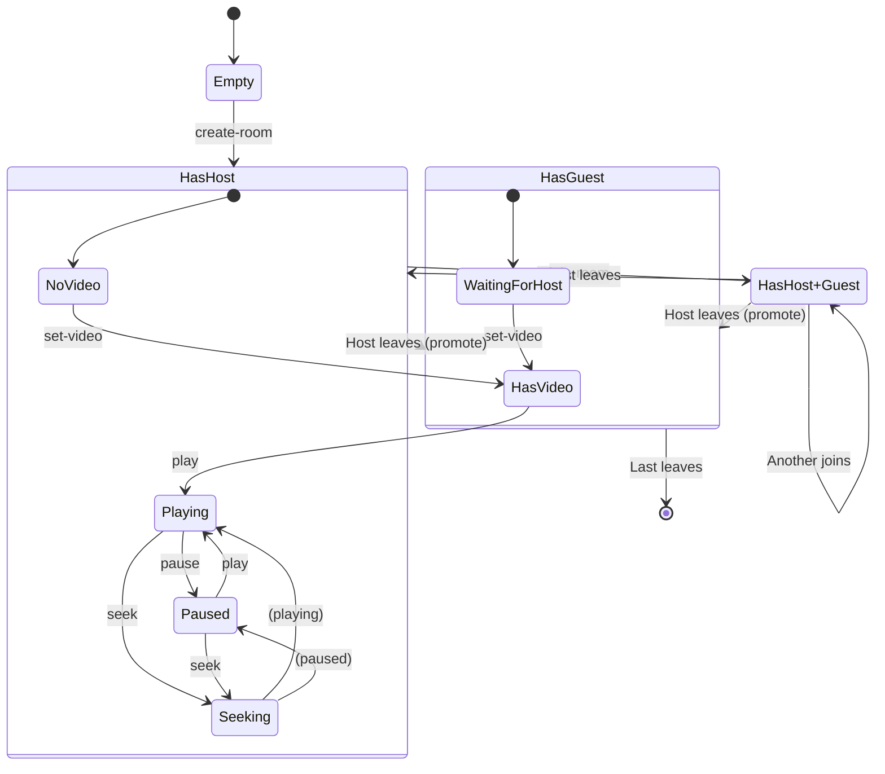

## Data Flow Diagrams

### Client-Server Communication

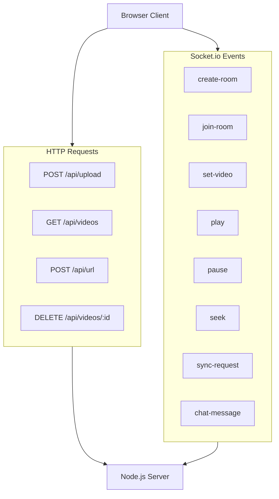

### Video Playback Decision Tree

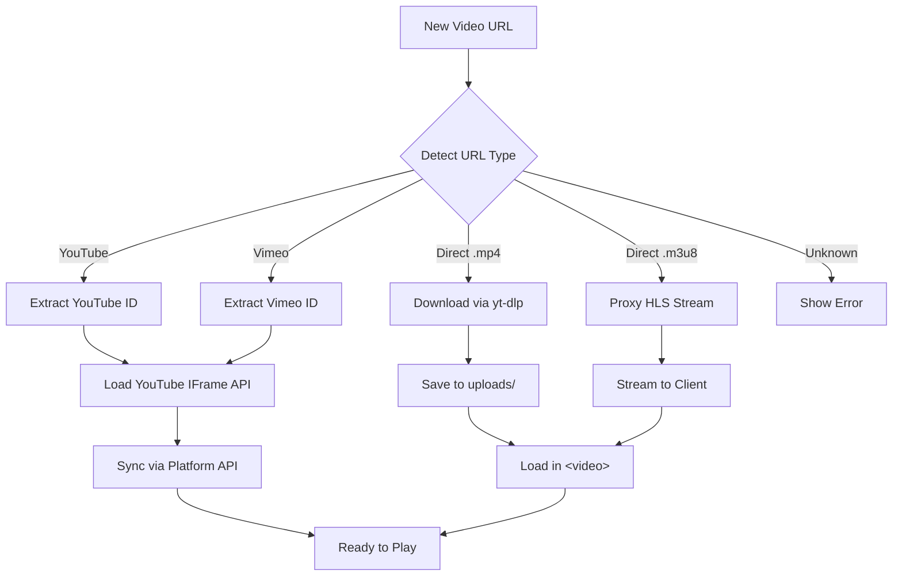

## Error Handling Flow

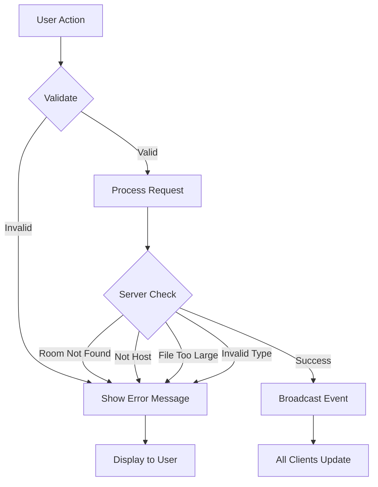

## Socket.io Event Reference

| Event | Direction | Payload | Description |
|-------|-----------|---------|-------------|
| `create-room` | Client → Server | `{name}` | Create new room, become host |
| `join-room` | Client → Server | `{roomCode, name}` | Join existing room |
| `set-video` | Client → Server | `{filename, url, type, ...}` | Host sets current video |
| `play` | Client → Server | `{currentTime}` | Host plays video |
| `pause` | Client → Server | `{currentTime}` | Host pauses video |
| `seek` | Client → Server | `{currentTime}` | Host seeks video |
| `sync-request` | Client → Server | `{}` | Guest requests current state |
| `chat-message` | Client → Server | `{text}` | Send chat message |
| `video-changed` | Server → Client | `{video}` | Video source updated |
| `play` | Server → Client | `{currentTime}` | Play command from host |
| `pause` | Server → Client | `{currentTime}` | Pause command from host |
| `seek` | Server → Client | `{currentTime}` | Seek command from host |
| `sync-response` | Server → Client | `{currentTime, playing}` | Sync state response |
| `chat-message` | Server → Client | `{name, text, at}` | Broadcast chat message |
| `member-update` | Server → Client | `{memberCount, joined/left}` | Room membership changed |
| `promoted-to-host` | Server → Client | - | You are now the host |

## Performance Considerations

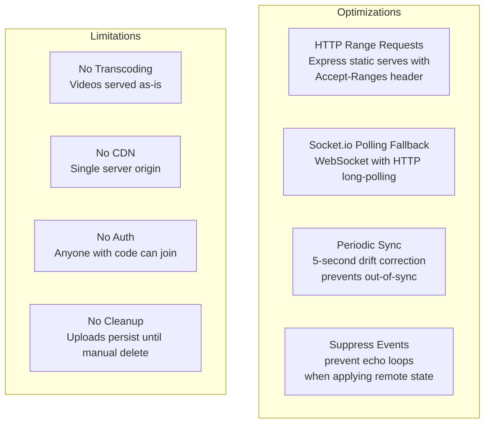

## Deployment Architecture

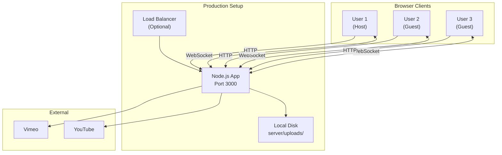
